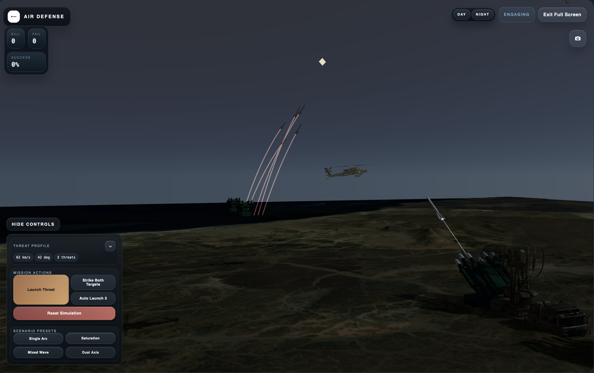
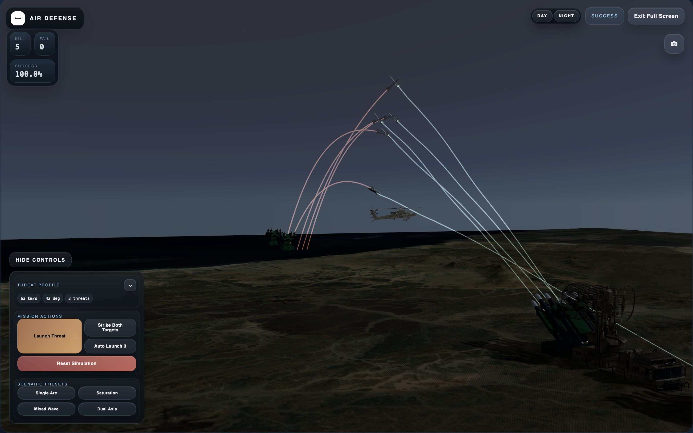

# Air Defense Simulation

Air Defense Simulation is a small full-stack tactical demo built around a live interceptor-vs-threat simulation loop. A FastAPI backend maintains the battlespace state, and a React + Three.js frontend renders that state as a command-console-style 3D experience with launch controls, telemetry, and engagement results.

## Highlights

- Live 3D tactical scene powered by React Three Fiber and Three.js
- FastAPI simulation service with endpoints for launch, reset, and step control
- Operator controls for threat speed, launch angle, threat count, and scenario presets
- Telemetry and results panels that reflect the current mission state in real time
- Day and night presentation modes in the tactical view

## Screenshots

### Launch Overview



### Intercept Close-Up


### Multi-Engagement Scenario



## Tech Stack

| Layer | Technologies |
| --- | --- |
| Frontend | React 19, TypeScript, Vite 6, Three.js, React Three Fiber, Drei |
| Backend | Python 3.11+, FastAPI, Uvicorn, NumPy, Pydantic |

## Project Structure

```text
air-def/
├── backend/
│   ├── app/
│   │   ├── main.py          # FastAPI entrypoint
│   │   ├── sim_engine.py    # Core simulation loop
│   │   ├── guidance.py      # Guidance / engagement logic
│   │   ├── tracker.py       # Radar tracking model
│   │   ├── physics.py       # Physics helpers
│   │   └── models.py        # Shared backend schemas
│   └── pyproject.toml
├── docs/
│   └── screenshots/         # README images and project media
├── frontend/
│   ├── public/              # Static models, audio, and branding assets
│   ├── src/
│   │   ├── components/      # Panels and UI shell
│   │   ├── sim/             # Three.js scene wiring
│   │   ├── api/             # Frontend API client
│   │   └── App.tsx          # Main application composition
│   └── package.json
└── README.md
```

## Getting Started

### Prerequisites

- Node.js 20+
- Python 3.11+

### 1. Start the backend

```bash
cd backend
python3 -m venv .venv
source .venv/bin/activate
pip install -e .
uvicorn app.main:app --reload --host 127.0.0.1 --port 8000
```

If editable install gives you trouble, install the dependencies directly instead:

```bash
pip install "fastapi>=0.115" "numpy>=2.1" "pydantic>=2.9" "uvicorn>=0.30"
uvicorn app.main:app --reload --host 127.0.0.1 --port 8000
```

Backend docs are available at [http://127.0.0.1:8000/docs](http://127.0.0.1:8000/docs).

### 2. Start the frontend

```bash
cd frontend
npm install
npm run dev
```

Open [http://127.0.0.1:5173](http://127.0.0.1:5173).

The frontend currently targets `http://127.0.0.1:8000` directly in [frontend/src/api/client.ts](/Users/atif/Desktop/air-def/frontend/src/api/client.ts). If you run the API somewhere else, update `API_BASE` before starting the app.

## How To Use The Demo

Once both services are running:

1. Open the command console in the browser.
2. Use the control panel to set threat speed, launch angle, and threat count.
3. Trigger one of the quick threat classes or scenario presets.
4. Watch the tactical scene, telemetry feed, and results panel update as the backend steps the simulation.
5. Use `Reset` to return the battlespace to its initial state.

The UI also includes a `Strike Both Targets` action, automated multi-threat launch behavior, and a fullscreen tactical mode for the 3D stage.

## HTTP API

| Method | Path | Description |
| --- | --- | --- |
| `GET` | `/health` | Health check |
| `GET` | `/state` | Return the current simulation snapshot |
| `POST` | `/scenario/launch` | Launch a threat with `speed`, `angle_deg`, and optional `target_id` |
| `POST` | `/scenario/strike-all` | Trigger the dual-target strike scenario |
| `POST` | `/simulation/step?steps=1` | Advance the simulation by the requested number of steps |
| `POST` | `/simulation/reset` | Reset the simulation state |

Simulation state is stored in memory inside a single API process, so one backend instance represents one live battlespace.

## Frontend Build

```bash
cd frontend
npm run build
npm run preview
```

This produces a static build in `frontend/dist`.

## Development Notes

- CORS is fully open in local development via FastAPI middleware and should be tightened for any real deployment.
- The repository includes large static assets under `frontend/public/`, including `.glb` models and audio files.
- GitHub currently accepts the repo, but large files such as `frontend/public/models/apache.glb` may be better managed with Git LFS if the asset set grows.

## Status

This project is currently set up as a local demo / prototype rather than a production deployment target. It is best suited for experimentation, UI iteration, and simulation feature expansion.
